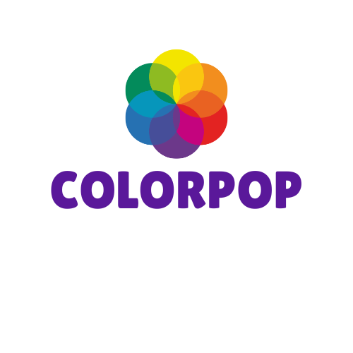

# 

## Description

**ColorPop** is a SwiftUI-based web app that allows users to generate color palettes based on their text input. Whether you're trying to describe the colors of a sunset, the shades of a landscape, or any other visual experience, ColorPop creates a unique color palette that reflects your input. Simply enter a word or phrase (like "sunset"), and ColorPop will generate a palette inspired by that description. 

### Purpose:
The goal of ColorPop is to allow users to easily translate visual experiences into color palettes. This helps users articulate visual concepts that might be difficult to describe with traditional color names.

### Tools Used:
- **API:** [ColorMagic API](https://colormagic.app/api/palette/search) – Provides color palettes based on user input.
- **Libraries/Frameworks:** Swift, SwiftUI, URLSession (for API calls)
- **Other Tools:** JSONDecoder (for decoding the color palette data from the API)

## Features
- **Color Palette Generation:** Enter text into a TextField (e.g., "sunset") and generate a custom color palette.
- **Palette Customization:** After generating the palette, users can interact with each color by clicking to view its hex code and a larger preview.

## Obstacles & Future Additions

### Obstacles:
- **API Limitations:** The app relies on an external API, so the availability and response time of that API can affect performance and reliability.

### Future Additions:
- **Image Upload:** Allow users to upload an image and generate a color palette based on the uploaded photo.
- **Palette Sharing:** Enable users to save and share their generated palettes with others.
- **Enhanced Customization:** Provide more advanced palette editing tools, such as adjusting individual color shades or exporting palettes in various formats.
- **Mobile Version:** Create a fully optimized version for iOS and Android devices, expanding accessibility for users on mobile platforms.

## Screenshots and Video

### Video Demo:
[Watch the video demo](Recording.mov)
